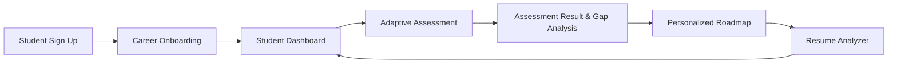

# SkillForge — AI-Powered Skill Assessment & Career Readiness Platform

[](https://nodejs.org/)
[](https://expressjs.com/)
[](https://react.dev/)
[](https://vitejs.dev/)
[](https://www.mongodb.com/atlas)
[](https://tailwindcss.com/)
[](#)

SkillForge is a full-stack, enterprise-grade career readiness and skill diagnostic platform designed to empower students and job seekers. It features deterministic skill gap analysis, adaptive technical assessments, personalized learning roadmaps, AI-assisted resume evaluation, and an administrative platform management console.

---

## Table of Contents
1. [Problem Statement](#problem-statement)
2. [Solution](#solution)
3. [Key Features](#key-features)
4. [Main User Flow](#main-user-flow)
5. [Admin Features](#admin-features)
6. [Skill Gap Engine](#skill-gap-engine)
7. [Technology Stack](#technology-stack)
8. [Architecture](#architecture)
9. [Project Structure](#project-structure)
10. [API Overview](#api-overview)
11. [MongoDB Collections](#mongodb-collections)
12. [Authentication & Security](#authentication--security)
13. [Resume Analyzer & AI](#resume-analyzer--ai)
14. [Installation](#installation)
15. [Environment Variables](#environment-variables)
16. [Running Locally](#running-locally)
17. [Testing](#testing)
18. [Deployment Guide](#deployment-guide)
19. [Screenshots](#screenshots)
20. [Future Improvements](#future-improvements)

---

## Problem Statement

Entering modern technical job markets is challenging for students and early-career developers:
- **Abstract Job Descriptions**: Job postings list dozens of overlapping skills without indicating proficiency thresholds.
- **Subjective Self-Assessment**: Learners guess their proficiency, leading to overconfidence or imposter syndrome.
- **Unfocused Study**: Without structured gap analysis, learners spend time revising concepts they already know rather than addressing critical deficits.
- **Resume-Job Mismatches**: Resumes frequently omit required industry keywords or fail applicant tracking standards.

---

## Solution

SkillForge delivers an end-to-end deterministic diagnostic pipeline:
1. **Target Track Alignment**: Students select their aspirational career track (Full Stack Developer, Data Analyst, Python Developer, Cybersecurity Analyst, etc.).
2. **Adaptive MCQ Assessments**: Dynamic technical assessments evaluate competencies across target skills, adjusting difficulty dynamically.
3. **Deterministic Skill Gap Analysis**: A mathematically rigorous engine identifies precise gaps against industry-defined proficiency levels.
4. **Actionable Learning Roadmap**: Automatically generates prioritized learning modules with curated documentation links to close identified gaps.
5. **Resume Analyzer & AI Diagnostics**: Extracts technical competencies from uploaded resumes (PDF/DOCX), computes match percentages, and offers actionable resume improvements.
6. **Platform Administration**: Provides instructors and administrators with platform-wide analytics and granular management over careers, skills, questions, and students.

---

## Key Features

- **Adaptive Assessments**: Algorithmic technical assessments that select questions based on career tracks and student performance.
- **Deterministic Skill Gap Engine**: Objective mathematical calculation of readiness scores and categorized skill tiers.
- **Personalized Learning Roadmap**: Ordered step-by-step curriculum focusing on critical and high-priority skill gaps.
- **Resume Parser & Keyword Matcher**: In-memory binary extraction of text from PDF and DOCX resumes, matching keywords against industry requirements.
- **AI-Powered Suggestions (With Graceful Fallback)**: OpenAI integration provides resume bullet points and career guidance when enabled, while falling back to deterministic recommendations if unconfigured or unavailable.
- **Comprehensive Admin Console**: Platform analytics, Recharts visualizations, student directory, career editor, skill library manager, and question bank editor.
- **Responsive Dark Mode UI**: Modern glassmorphic interface built with Tailwind CSS, custom gradients, and Lucide icons.

---

## Main User Flow



1. **Sign Up & Onboarding**: Register an account and choose an aspirational career track.
2. **Dashboard Overview**: Access readiness metrics, target career requirements, and quick-start actions.
3. **Technical Assessment**: Complete an assessment with questions tailored to the chosen career.
4. **Gap Analysis & Readiness**: View calculated readiness percentage and classification across all target skills.
5. **Personalized Roadmap**: Follow prioritized modules with direct links to official documentation and learning materials.
6. **Resume Evaluation**: Upload a resume to evaluate alignment with the target career track.

---

## Admin Features

SkillForge includes an administrative console accessible exclusively to users with `role: "admin"`:

- **Platform Analytics (`/admin`)**:
  - Aggregated metrics: Total students, active careers, skills count, question bank volume, assessment completion counts, average assessment scores, and resume match statistics.
  - Interactive Recharts: Student career distribution charts, assessment completion ratios, and performance overviews.
  - Recent student registrations table.
- **Student Management (`/admin/students`)**:
  - Filter by target career and live search by student name or email.
  - Pagination controls.
  - Strict privacy: Passwords, password hashes, JWTs, and private resume contents are completely omitted from API payloads.
- **Career Management (`/admin/careers`)**:
  - Create, edit, and delete career tracks.
  - **Data Integrity Protection**: Prevents deletion of careers that are referenced by active students, assessments, results, roadmaps, or resume analyses.
- **Skill Management (`/admin/skills`)**:
  - Manage skills with category tags (Frontend, Backend, Database, Security, DevOps, etc.).
  - Duplicate skill name prevention.
  - Association counter tracking linked careers.
  - Deletion safeguards for skills associated with active careers or questions.
- **Question Bank Management (`/admin/questions`)**:
  - Filter questions by career, skill, and difficulty (Easy, Medium, Hard).
  - Add and update 4-option multiple-choice questions with answer keys and explanations.
  - **Student Security Boundary**: Admin views have access to `correctAnswer`, while student assessment endpoints omit it.

---

## Skill Gap Engine

The SkillForge Skill Gap Engine is entirely deterministic, preventing hallucinations or arbitrary evaluations.

### 1. Gap Formula
For each skill required by the student's target career:
$$\text{SkillGap} = \max(0, \text{RequiredSkillLevel} - \text{StudentSkillLevel})$$

- If a student has not been assessed on a required skill, their score defaults to `0`.
- If a student exceeds the required level, the gap clamps to `0`.

### 2. Readiness Score Formula
The overall career readiness score is computed as:
$$\text{ReadinessScore} = \left(\frac{\sum \text{ClampedStudentSkillScore}}{\sum \text{RequiredSkillLevel}}\right) \times 100$$

Where $\text{ClampedStudentSkillScore} = \min(\text{StudentScore}, \text{RequiredLevel})$.

### 3. Classification Tiers
Each required skill is classified into one of four deterministic tiers:

| Gap Range | Status Tier | Description |
|---|---|---|
| **0 – 10%** | **Strong** | Exceeds or closely aligns with target job requirements. |
| **11 – 25%** | **Moderate** | Solid foundation with minor areas for refinement. |
| **26 – 40%** | **Needs Improvement** | Noticeable gap requiring guided learning and practice. |
| **41%+** | **Critical Gap** | Significant competency gap; highest priority in learning roadmap. |

---

## Technology Stack

### Frontend Client
- **Framework**: React 19 (Hooks, Context API, Single Page Application)
- **Tooling**: Vite 6 (Fast HMR, optimized production rollup packaging)
- **Styling**: Tailwind CSS v4 (Modern responsive utility system)
- **Icons**: Lucide React
- **Data Visualization**: Recharts (Responsive bar and pie distribution charts)
- **Routing**: React Router DOM v7 (Route guards, nested layouts, catch-all 404 handler)

### Backend Server
- **Runtime**: Node.js (v18+)
- **Framework**: Express.js 4 (REST API architecture)
- **Database ODM**: Mongoose 8
- **Authentication**: JSON Web Tokens (JWT) & bcryptjs password hashing
- **File Parsing**: `pdf-parse` (PDF text extraction), `mammoth` (DOCX extraction), `multer` (in-memory buffer processing)
- **CORS**: Configurable origin middleware supporting production domains and local development

### Database & Cloud Services
- **Database**: MongoDB Atlas (Cloud database with replica sets and automated indexes)
- **AI Integration**: OpenAI API (GPT-4o-mini / GPT-3.5-turbo with deterministic fallback)
- **Deployment Targets**: Vercel (Frontend), Render (Backend)

---

## Architecture

```
┌─────────────────────────────────────────────────────────────┐
│                       Client Layer                          │
│   React 19 SPA + Vite + Tailwind CSS + Lucide + Recharts    │
│   (Protected Routes, Admin Guards, AuthContext, Responsive) │
└──────────────────────────────┬──────────────────────────────┘
                               │ HTTPS / REST API
┌──────────────────────────────▼──────────────────────────────┐
│                    API & Middleware Layer                   │
│   Express.js + CORS + JWT Authentication + requireAdmin     │
│   Multer (MemoryStorage) + Centralized Error Handling       │
└──────────────────────────────┬──────────────────────────────┘
                               │
       ┌───────────────────────┼────────────────────────┐
       ▼                       ▼                        ▼
┌──────────────┐      ┌─────────────────┐      ┌─────────────────┐
│ Database     │      │ Engine Services │      │ AI Services     │
│ MongoDB      │      │ • Skill Gap     │      │ • OpenAI Client │
│ Atlas        │      │ • Adaptive MCQ  │      │ • Non-blocking  │
│ (8 Models)   │      │ • Roadmap Gen   │      │   Deterministic │
│              │      │ • Resume Parser │      │   Fallback      │
└──────────────┘      └─────────────────┘      └─────────────────┘
```

---

## Project Structure

```text
SkillForge/
├── client/                     # Frontend Application (React + Vite)
│   ├── src/
│   │   ├── components/         # Reusable UI (Navbar, Footer, ProtectedRoute, AdminProtectedRoute)
│   │   ├── context/            # AuthContext (JWT token storage, session management)
│   │   ├── pages/              # 18 Application Pages (Dashboard, Assessment, Admin, etc.)
│   │   ├── App.jsx             # Main router configuration & route protection
│   │   ├── main.jsx            # React root mount
│   │   └── index.css           # Global stylesheet & Tailwind directives
│   ├── .env.example            # Sample client environment configuration
│   ├── .gitignore              # Client git ignore rules
│   ├── package.json            # Client dependencies and build scripts
│   └── vite.config.js          # Vite build configuration
│
├── server/                     # Backend Application (Node.js + Express)
│   ├── src/
│   │   ├── config/             # Database connection & idempotent seeders
│   │   ├── controllers/        # Route controllers (Auth, Assessment, Admin, Resume, etc.)
│   │   ├── middleware/         # Auth verification, role guards, upload handlers
│   │   ├── models/             # Mongoose Schemas (User, Career, Skill, Question, etc.)
│   │   ├── routes/             # Express API routes
│   │   ├── services/           # Skill Gap Engine, Resume Parser, Roadmap, AI service
│   │   ├── app.js              # Express app setup, CORS, error handling
│   │   └── server.js           # Server entry point
│   ├── create-admin.js         # Administrative user seeding script
│   ├── test-stage3.js          # Careers & Skills automated test suite
│   ├── test-stage4.js          # Assessment & Adaptive MCQ test suite
│   ├── test-stage5.js          # Skill Gap Engine test suite
│   ├── test-stage6.js          # Learning Roadmap test suite
│   ├── test-stage7.js          # Student Dashboard analytics test suite
│   ├── test-stage8.js          # Resume Analyzer & AI test suite
│   ├── test-stage9.js          # Admin Dashboard & Platform Management test suite
│   ├── test-mvp-fixes.js       # Core MVP UX verification suite
│   ├── test-atlas-persistence.js # MongoDB Atlas persistence verification
│   ├── .env.example            # Sample server environment configuration
│   ├── .gitignore              # Server git ignore rules
│   └── package.json            # Server dependencies and test scripts
│
├── FINAL_PROJECT_REPORT.md     # Comprehensive Stage 10 verification report
└── README.md                   # Complete platform documentation
```

---

## API Overview

### 1. Authentication & Profile
| Method | Endpoint | Protection | Description |
|---|---|---|---|
| `POST` | `/api/auth/register` | Public | Register new student account with name, email, password |
| `POST` | `/api/auth/login` | Public | Authenticate user and receive JWT bearer token |
| `GET` | `/api/auth/me` | Bearer Token | Retrieve currently authenticated user profile |
| `PUT` | `/api/auth/profile/career` | Bearer Token | Update student's target career track |

### 2. Careers & Skills
| Method | Endpoint | Protection | Description |
|---|---|---|---|
| `GET` | `/api/careers` | Public | Get all active career tracks with required skills |
| `GET` | `/api/careers/:id` | Public | Get single career track details |
| `GET` | `/api/skills` | Public | Get full technical skill catalog |

### 3. Assessment & Readiness
| Method | Endpoint | Protection | Description |
|---|---|---|---|
| `POST` | `/api/assessment/start` | Bearer Token | Start a career assessment and receive first question |
| `POST` | `/api/assessment/:id/submit` | Bearer Token | Submit answer and receive adaptive next question |
| `POST` | `/api/assessment/:id/complete`| Bearer Token | Complete session and calculate skill scores |
| `GET` | `/api/assessment/latest` | Bearer Token | Fetch most recent assessment outcome |
| `GET` | `/api/assessment/history`| Bearer Token | Fetch all past assessment sessions |
| `GET` | `/api/analysis/readiness`| Bearer Token | Run Skill Gap Engine on latest assessment |

### 4. Learning Roadmap & Dashboard
| Method | Endpoint | Protection | Description |
|---|---|---|---|
| `GET` | `/api/roadmap` | Bearer Token | Get current student's personalized roadmap |
| `POST` | `/api/roadmap/generate`| Bearer Token | Force regenerate roadmap from latest skill gaps |
| `PATCH`| `/api/roadmap/items/:id`| Bearer Token | Toggle roadmap module completion status |
| `GET` | `/api/dashboard` | Bearer Token | Aggregated student analytics, progress, and history |

### 5. Resume Analyzer
| Method | Endpoint | Protection | Description |
|---|---|---|---|
| `POST` | `/api/resume/analyze` | Bearer Token | Upload PDF/DOCX (<= 5MB) for skill matching |
| `GET` | `/api/resume/latest` | Bearer Token | Get latest resume match report and suggestions |
| `GET` | `/api/resume/history` | Bearer Token | List all previous resume analysis reports |

### 6. Admin Management
| Method | Endpoint | Protection | Description |
|---|---|---|---|
| `GET` | `/api/admin/dashboard` | Admin Only | Platform-wide analytics and distribution KPIs |
| `GET` | `/api/admin/students` | Admin Only | Paginated student registry with search & career filters |
| `GET` | `/api/admin/careers` | Admin Only | Careers catalog with populated skills |
| `POST` | `/api/admin/careers` | Admin Only | Create new career track |
| `PUT` | `/api/admin/careers/:id` | Admin Only | Update career track details |
| `DELETE`| `/api/admin/careers/:id` | Admin Only | Delete career (safeguarded against active references) |
| `GET` | `/api/admin/skills` | Admin Only | Skills catalog with career associations |
| `POST` | `/api/admin/skills` | Admin Only | Create new skill (duplicate names prevented) |
| `PUT` | `/api/admin/skills/:id` | Admin Only | Update skill metadata |
| `DELETE`| `/api/admin/skills/:id` | Admin Only | Delete skill (safeguarded against dependencies) |
| `GET` | `/api/admin/questions` | Admin Only | Question bank with answer keys and explanations |
| `POST` | `/api/admin/questions` | Admin Only | Add 4-option question |
| `PUT` | `/api/admin/questions/:id` | Admin Only | Update question content |
| `DELETE`| `/api/admin/questions/:id` | Admin Only | Delete question |

### 7. Health Check
| Method | Endpoint | Protection | Description |
|---|---|---|---|
| `GET` | `/api/health` | Public | Server status, timestamp, and environment mode |

---

## MongoDB Collections

SkillForge structures data across 8 distinct collections:

1. **`users`**: User records, hashed passwords, role (`student` or `admin`), `targetCareer`, `targetCareerRef`, and onboarding state.
2. **`careers`**: Career tracks, descriptions, and array of `requiredSkills` with numeric `targetLevel` benchmarks.
3. **`skills`**: Technical skill library items with name, category, and description.
4. **`questions`**: Assessment questions with 4 options, difficulty, skill reference, optional career tag, and protected `correctAnswer` (hidden from student queries).
5. **`assessments`**: In-progress and completed assessment sessions, current difficulty, and answer submissions.
6. **`assessmentresults`**: Completed assessment scores, overall percentage, and individual skill proficiency scores.
7. **`roadmaps`**: Generated learning roadmaps, ordered modules, resource links, and completion states.
8. **`resumeanalyses`**: Parsed resume metadata, extracted skills, target career match scores, and AI/deterministic suggestions.

---

## Authentication & Security

- **JWT Authentication**: Secure stateless token authentication. Tokens are stored in browser local storage and transmitted via the `Authorization: Bearer <token>` header.
- **Bcrypt Password Hashing**: Passwords are salted and hashed (cost factor 10) before storage. Plaintext passwords are never stored or logged.
- **Role-Based Access Control**:
  - `requireAdmin` backend middleware prevents unauthorized student access to admin endpoints (`HTTP 403 Forbidden`).
  - Unauthenticated requests to protected endpoints return `HTTP 401 Unauthorized`.
- **Information Protection**:
  - Student queries strictly exclude `password`, `passwordHash`, and sensitive metadata.
  - Assessment endpoints never expose `correctAnswer` in student payloads (`correctAnswer: { select: false }`).
- **Data Isolation**: Students can only access their own assessments, results, roadmaps, and resume analyses.
- **CORS Protection**: Origin validation allows only configured domains (`CLIENT_URL` / `CORS_ORIGIN`) in production while supporting localhost in development.

---

## Resume Analyzer & AI

- **Binary Text Extraction**: Utilizes `pdf-parse` for PDF files and `mammoth` for DOCX documents.
- **Size & Format Constraints**: Enforces a strict 5 MB file size limit and rejects non-PDF/DOCX uploads with clear error messages.
- **Deterministic Skill Match**: Tokenizes resume content, detects skills case-insensitively, and compares them against target career requirements:
$$\text{MatchScore} = \left(\frac{\text{MatchedSkillsCount}}{\text{TotalCareerRequiredSkillsCount}}\right) \times 100$$
- **AI Enrichment with Fallback**:
  - If `OPENAI_API_KEY` is present, OpenAI generates customized resume bullet points, skill acquisition guidance, and profile summaries.
  - If `OPENAI_API_KEY` is absent or the API is unreachable, the system falls back to rule-based suggestions without disrupting the user experience or altering the match score.

---

## Installation

### Prerequisites
- Node.js (v18.0.0 or higher)
- npm (v9.0.0 or higher)
- MongoDB Atlas cluster URI (or local MongoDB v6.0+)

### Clone Repository
```bash
git clone https://github.com/darshitazaveri16-svg/skillforge.git
cd skillforge
```

### Install Dependencies
```bash
# Install backend dependencies
cd server
npm install

# Install frontend dependencies
cd ../client
npm install
```

---

## Environment Variables

### Backend Configuration (`server/.env`)
Create `server/.env` based on `server/.env.example`:
```env
PORT=5000
MONGODB_URI=mongodb+srv://<username>:<password>@<cluster>.mongodb.net/skillforge?retryWrites=true&w=majority
NODE_ENV=development
JWT_SECRET=your_super_secret_jwt_key_at_least_32_characters
JWT_EXPIRE=30d
CLIENT_URL=http://localhost:5173
OPENAI_API_KEY=your_optional_openai_api_key
```

### Frontend Configuration (`client/.env`)
Create `client/.env` based on `client/.env.example`:
```env
VITE_API_URL=http://localhost:5000/api
```

---

## Running Locally

### 1. Start the Backend API
```bash
cd server
npm run dev
```
The server will initialize on `http://localhost:5000`, connect to MongoDB Atlas, and execute idempotent seeders for careers, skills, and questions.

### 2. Start the Frontend Application
```bash
cd client
npm run dev
```
The Vite development server will start on `http://localhost:5173`.

### 3. Create an Admin User (Optional)
To create an administrative user locally or on Atlas:
```bash
cd server
ADMIN_EMAIL="admin@skillforge.test" ADMIN_PASSWORD="AdminPassword123!" node create-admin.js
```

---

## Testing

SkillForge includes an automated testing suite covering all stages:

```bash
cd server

# 1. Careers & Skills Management
node test-stage3.js

# 2. Skill Assessment & Adaptive Engine
node test-stage4.js

# 3. Deterministic Skill Gap Engine
node test-stage5.js

# 4. Personalized Learning Roadmap
node test-stage6.js

# 5. Student Dashboard Analytics
node test-stage7.js

# 6. Resume Analyzer & AI Integration (64 assertions)
node test-stage8.js

# 7. Admin Dashboard & Platform Management (44 assertions)
node test-stage9.js

# 8. Core MVP UX & Navigation Verification (46 tests)
node test-mvp-fixes.js

# 9. MongoDB Atlas Persistence Verification (17 checks)
node test-atlas-persistence.js
```

### Build Verification
```bash
cd client
npm run build
```

---

## Deployment Guide

### Frontend Deployment (Vercel)
1. Push your repository to GitHub.
2. Link the repository in the Vercel Dashboard.
3. Configure the project:
   - **Framework Preset**: Vite
   - **Root Directory**: `client`
   - **Build Command**: `npm run build`
   - **Output Directory**: `dist`
4. Add Environment Variable:
   - `VITE_API_URL`: `https://your-backend-service.onrender.com/api`
5. Deploy.

### Backend Deployment (Render)
1. In Render, create a new **Web Service**.
2. Connect your GitHub repository.
3. Configure the service:
   - **Root Directory**: `server`
   - **Runtime**: Node
   - **Build Command**: `npm install`
   - **Start Command**: `npm start`
4. Set Environment Variables:
   - `NODE_ENV`: `production`
   - `PORT`: `10000`
   - `MONGODB_URI`: Your MongoDB Atlas connection string
   - `JWT_SECRET`: A secure random secret string
   - `CLIENT_URL`: `https://your-frontend.vercel.app`
   - `OPENAI_API_KEY`: (Optional) Your OpenAI API key
5. Deploy.

---

## Screenshots

> *Screenshots can be added here to showcase key views of the application.*

### 1. Student Dashboard & Skill Gap Analytics
*Visual representation of student readiness scores, target career benchmarks, and gap tier breakdown.*

### 2. Adaptive Technical Assessment
*Clean assessment interface displaying progressive multiple-choice questions without exposing answer keys.*

### 3. Personalized Learning Roadmap
*Prioritized modules addressing identified skill gaps with completion toggles and documentation links.*

### 4. Resume Analyzer & Scorecard
*Keyword matching interface comparing uploaded resume competencies against target job requirements.*

### 5. Admin Dashboard & Management Console
*Platform-wide analytics, Recharts visualizations, and management consoles for careers, skills, and questions.*

---

## Future Improvements

- **Interactive Coding Sandboxes**: Integrate in-browser code execution for practical technical evaluations alongside multiple-choice assessments.
- **Peer & Mentor Reviews**: Allow students to share their learning roadmaps and resume analyses with mentors for feedback.
- **Enterprise Job Board Integration**: Match high-readiness students directly with hiring partners based on verified skill competencies.
- **Multi-Factor Authentication (MFA)**: Provide optional TOTP-based two-factor authentication for administrative accounts.

---

## License

This project is licensed under the MIT License. Developed for technical evaluation and career readiness demonstration.
